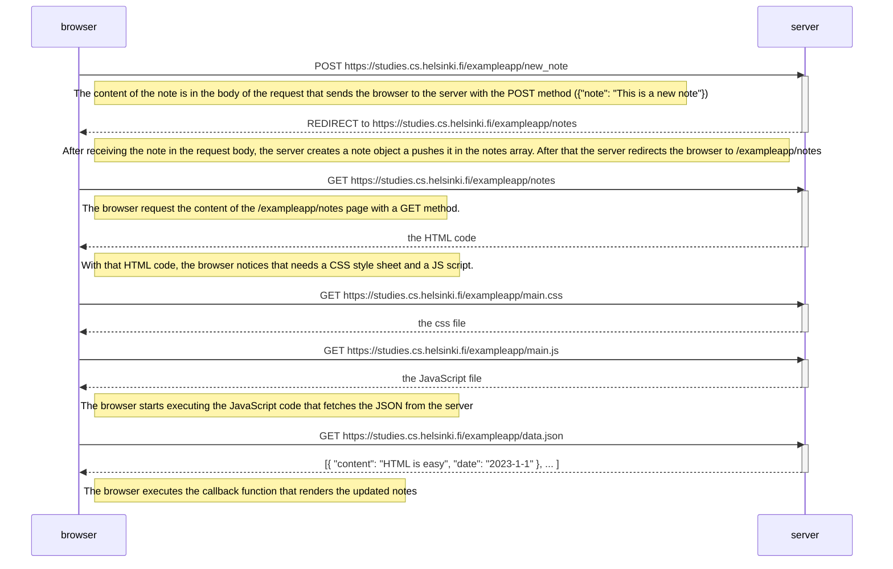

**New note diagram**

```mermaid
sequenceDiagram
    participant browser
    participant server

    browser->>server: POST https://studies.cs.helsinki.fi/exampleapp/new_note
    activate server

    Note right of browser: The content of the note is in the body of the request that sends the browser to the server with the POST method ({"note": "This is a new note"})

    server-->>browser: REDIRECT to https://studies.cs.helsinki.fi/exampleapp/notes
    deactivate server

    Note left of server: After receiving the note in the request body, the server creates a note object a pushes it in the notes array. After that the server redirects the browser to /exampleapp/notes

    browser->>server: GET https://studies.cs.helsinki.fi/exampleapp/notes
    activate server

    Note right of browser: The browser request the content of the /exampleapp/notes page with a GET method. 
  
    server-->>browser: the HTML code
    deactivate server

    Note right of browser: With that HTML code, the browser notices that needs a CSS style sheet and a JS script.

    browser->>server: GET https://studies.cs.helsinki.fi/exampleapp/main.css
    activate server
    server-->>browser: the css file
    deactivate server

    browser->>server: GET https://studies.cs.helsinki.fi/exampleapp/main.js
    activate server
    server-->>browser: the JavaScript file
    deactivate server

    Note right of browser: The browser starts executing the JavaScript code that fetches the JSON from the server

    browser->>server: GET https://studies.cs.helsinki.fi/exampleapp/data.json
    activate server
    server-->>browser: [{ "content": "HTML is easy", "date": "2023-1-1" }, ... ]
    deactivate server

    Note right of browser: The browser executes the callback function that renders the updated notes
```
