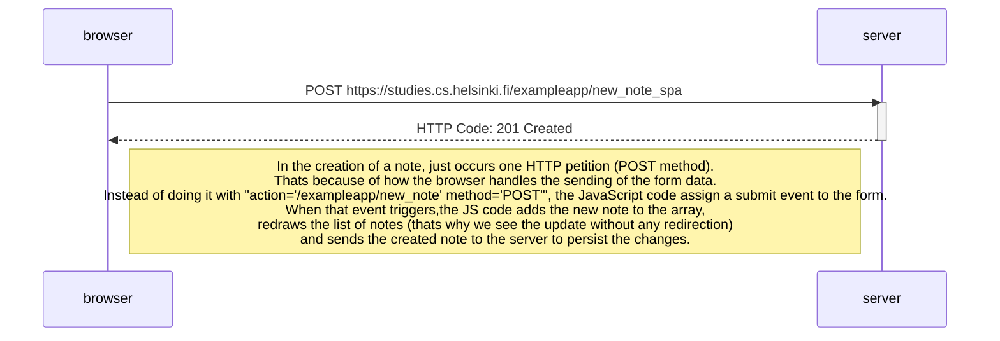

**New note in SPA Diagram**

```mermaid

sequenceDiagram
    participant browser
    participant server

    browser->>server: POST https://studies.cs.helsinki.fi/exampleapp/new_note_spa
    activate server
    server-->>browser: HTTP Code: 201 Created
    deactivate server

    Note right of browser: In the creation of a note, just occurs one HTTP petition (POST method).<br/>Thats because of how the browser handles the sending of the form data. <br/>Instead of doing it with "action='/exampleapp/new_note' method='POST'", the JavaScript code assign     a submit event to the form.<br/> When that event triggers,the JS code adds the new note to the array,<br/> redraws the list of notes (thats why we see the update without any redirection) <br/> and sends the created note to the server to persist the changes.

```
